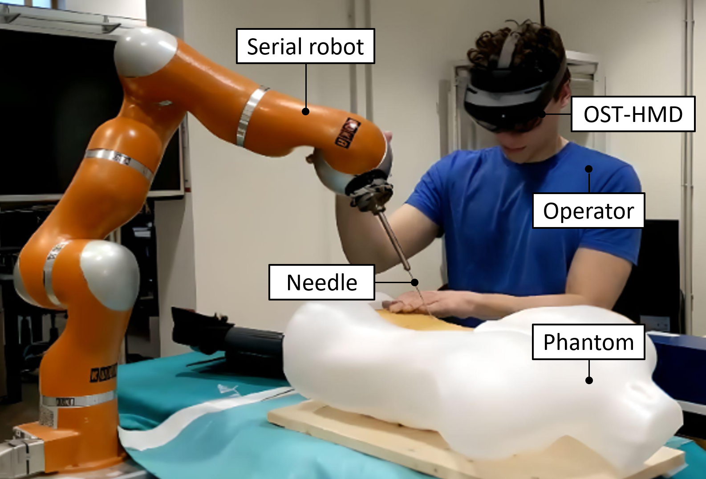
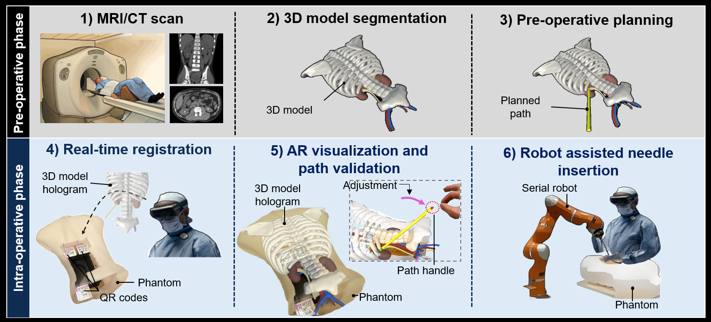

# Augmented Reality and Robot-Assisted Needle Insertion for Percutaneous Nephrolithotomy Task

  

    Main authors: Matteo Pecorella, Junling Fu.
 
***
This repository contains the implementation of an Augmented Reality (AR) visualization-based path planning and navigation system for Percutaneous Nephrolithotomy (PCNL) with robotic-guided needle insertion. The aim of this project is to improve the PCNL procedure by reducing the surgeon's workload and achieving better insertion accuracy.

  

## Introduction
PCNL is considered the gold standard for treating patients with kidney stones larger than 20mm. It is a minimally invasive surgical procedure that involves inserting a nephroscope into the kidney to break up the stone and suction out the pieces. However, there are limitations to the procedure, including the surgeon's workload and challenges in precise needle insertion.

To address these limitations, this project proposes an AR-based system that provides real-time visualization and guidance during the PCNL procedure. The system utilizes pre-operative MRI or CT scan images to generate a 3D model and plan the desired path. During the intra-operative phase, the surgeon uses an Optical See Through - Head Mounted Display (OST-HMD) to perform real-time registration and visualize the 3D model hologram superimposed on the patient. The surgeon can validate and adjust the pre-planned path based on intra-operative images and is assisted by a serial robot for needle insertion.

## System Architecture
The proposed system architecture is divided into two phases: the pre-operative and intra-operative phases.

During the pre-operative phase:
1. MRI or CT scan images of the patient are acquired 
2. The images are segmented to generate a 3D model.
3. The desired path for needle insertion is planned based on the 3D model.

During the intra-operative phase:

4. The surgeon uses an OST-HMD to perform real-time registration 
6. The surgeon visualize the 3D model hologram superimposed on the patient and validates and adjusts the pre-planned path based on intra-operative images.
7. A serial robot assists the surgeon during needle insertion, following the pre-planned path.

The system relies on an Optical Tracker (OT) for system calibration and to measure the accuracy. It also utilizes QR code markers and fiducial markers on a phantom model   for accurate registration.

  

## Demo video

Preview:

https://github.com/MatteoPeco/PCNL_Task_System/assets/94977542/232d6fe9-3dc1-4e2f-8acd-c8fc2c684b77

Complete demo video at:  

  https://drive.google.com/file/d/1Bb8xHS0bwqG7Qv82C1dTycltremJzU55/view?usp=share_link

## Experimental Validation
The system's performance and usability were evaluated through experiments involving 14 users with no prior surgery or AR headset experience. The users performed the needle insertion procedure using four different system setups: screen-based manual setup, AR-based manual setup, screen-based + robot assistance setup, and AR-based + robot assistance setup. Each setup was repeated three times, and the users' insertion accuracy was measured.

The performance metrics shown below include:

- Insertion procedure accuracy: Assessing the accuracy of needle insertion along the pre-planned path.
- Usability: Gathering qualitative feedback through a questionnaire to evaluate the user's workload during the tasks.

## Performances:

- Insertion procedure accuracy: 
  - Translation error from the target (median ± std.) -> 3.2 ± 1.4 mm 
  - Orientation error with respect to the pre-planned path (median ± std.)->  1.2 ± 0.9° 

## Repository Structure
- src/: Contains the unity project to be uploaded in the Hololens2 and the ROS catkin_ws for the robot control.
- images/: Contains the images of the repository.
- docs/: Contains the documentation and user manual for the system.
- videos/: Includes demo videos showcasing the system in action.

