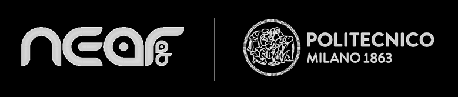

NB: La versione in italiano si trova nella seconda metà dei file README della repository
#
Eng:
# Augmented Reality and Robot-Assisted Needle Insertion for Percutaneous Nephrolithotomy Task

  

  

    Main authors: Matteo Pecorella, Junling Fu.
 
***
This repository contains the implementation of an Augmented Reality (AR) visualization-based path planning and navigation system for Percutaneous Nephrolithotomy (PCNL) with robotic-guided needle insertion. The aim of this project is to improve the PCNL procedure by reducing the surgeon's workload and achieving better insertion accuracy.

  

## Introduction
PCNL is considered the gold standard for treating patients with kidney stones larger than 20mm. It is a minimally invasive surgical procedure that involves inserting a nephroscope into the kidney to break up the stone and suction out the pieces. However, there are limitations to the procedure, including the surgeon's workload and challenges in precise needle insertion.

To address these limitations, this project proposes an AR-based system that provides real-time visualization and guidance during the PCNL procedure. The system utilizes pre-operative MRI or CT scan images to generate a 3D model and plan the desired path. During the intra-operative phase, the surgeon uses an Optical See Through - Head Mounted Display (OST-HMD) to perform real-time registration and visualize the 3D model hologram superimposed on the patient. The surgeon can validate and adjust the pre-planned path based on intra-operative images and is assisted by a serial robot for needle insertion.

## System Architecture
The proposed system architecture is divided into two phases: the pre-operative and intra-operative phases.

During the pre-operative phase:
1. MRI or CT scan images of the patient are acquired 
2. The images are segmented to generate a 3D model.
3. The desired path for needle insertion is planned based on the 3D model.

During the intra-operative phase:

4. The surgeon uses an OST-HMD to perform real-time registration 
5. The surgeon visualize the 3D model hologram superimposed on the patient and validates and adjusts the pre-planned path based on intra-operative images.
6. A serial robot assists the surgeon during needle insertion, following the pre-planned path.

The system relies on an Optical Tracker (OT) for system calibration and to measure the accuracy. It also utilizes QR code markers and fiducial markers on a phantom model   for accurate registration.

  

## Demo video

Preview:

https://github.com/MatteoPeco/PCNL_Task_System/assets/94977542/232d6fe9-3dc1-4e2f-8acd-c8fc2c684b77

Complete demo video at:  

  https://drive.google.com/file/d/1Bb8xHS0bwqG7Qv82C1dTycltremJzU55/view?usp=share_link

## Experimental Validation
The system's performance and usability were evaluated through experiments involving 14 users with no prior surgery or AR headset experience. The users performed the needle insertion procedure using four different system setups: screen-based manual setup (SM), AR-based manual setup (AM), screen-based + robot assistance setup (SA), and AR-based + robot assistance setup (AA). Each setup was repeated three times, and the users' insertion accuracy was measured.

The performance metrics shown below include:

- Insertion procedure accuracy: Assessing the accuracy of needle insertion along the pre-planned path.
- Usability: Gathering qualitative feedback through a questionnaire to evaluate the user's workload during the tasks.

## Performances:

- Insertion procedure accuracy: 
  - Translation error from the target (median ± std.) -> 3.2 ± 1.4 mm 
  - Orientation error with respect to the pre-planned path (median ± std.) ->  1.2 ± 0.9° 
- Usability: The qualitative feedback gathered through the user questionnaire shown that the proposed system (AA) had the *__highest__* usability compared to all the other setups, including the setup emulating the operating room (SM).

## Repository Structure
- src/: Contains the unity project to be uploaded in the Hololens2 and the ROS catkin_ws for the robot control.
- images/: Contains the images of the repository.
- docs/: Contains the user manual for the system and a more detailed explaination of the robot control strategy.
- videos/: Includes demo videos showcasing the system in action.
#
Ita:
# Sistema basato su Realtà Aumentata e Assistenza Robotica per la procedura di inserzione di una Nefrolitotrissia Percutanea

  

    Autori principali: Matteo Pecorella, Junling Fu.
 
***
Questa repository contiene l'implementazione di un sistema di pianificazione e navigazione chirurgica basato sulla Realtà Aumentata (RA) per la Nefrolitotrissia Percutanea (PCNL) in cui la fase di inserzione è supportata da un robot. L'obiettivo di questo progetto è migliorare la procedura PCNL riducendo il carico di lavoro del chirurgo e ottenendo una maggiore accuratezza nell'inserzione.

  

## Introduzione
La PCNL è considerata lo standard di riferimento per il trattamento dei pazienti con calcoli renali di dimensioni superiori a 20 mm. Si tratta di una procedura chirurgica minimamente invasiva che prevede l'inserimento di un nefroscopio nel rene per frammentare il calcolo e aspirare i frammenti. Tuttavia, ci sono limitazioni alla procedura, tra cui il carico di lavoro del chirurgo e la comlessità nel raggiungere un'inserzione accurata.

Per affrontare queste limitazioni, questo progetto propone un sistema basato su RA e assistenza robotica per visualizzare e guidare in tempo reale la procedura PCNL. Il sistema utilizza immagini pre-operatorie di risonanza magnetica (MRI) o tomografia computerizzata (CT) per generare un modello 3D e pianificare il percorso d'inserzione desiderato. Durante la fase intra-operatoria, il chirurgo utilizza un visore "Optical See Through - Head Mounted Display" (OST-HMD) per effettuare la registrazione in tempo reale e visualizzare l'ologramma del modello 3D sovrapposto al paziente. Il chirurgo può convalidare e regolare il percorso d'inserzione in base alle immagini intra-operatorie ed è assistito da un robot seriale per l'inserimento dell'ago.

## Architettura del Sistema
Il sistema ha un'architettura è divisa in due fasi: la fase pre-operatoria e la fase intra-operatoria.

Durante la fase pre-operatoria:

1. Vengono acquisite le immagini di risonanza magnetica (MRI) o tomografia computerizzata (CT) del paziente.
2. Le immagini vengono segmentate per generare un modello 3D.
3. Viene pianificato il percorso per l'inserzione basandosi sul modello 3D.

Durante la fase intra-operatoria:

4. Il chirurgo utilizza un visore in RA per effettuare la registrazione in tempo reale.
5. Il chirurgo visualizza l'ologramma del modello 3D sovrapposto al paziente e convalida e regola il percorso pre-pianificato in base alle immagini intra-operatorie.
6. Un robot seriale assiste il chirurgo durante l'inserzione, seguendo il percorso pre-pianificato.

Il sistema si basa su un sistema di tracciamento ottico (OT) per la calibrazione del sistema e per misurare l'accuratezza. Utilizza inoltre QR code e marcature su un manichino per una registrazione accurata.

  

## Video dimostrativo

Anteprima:

https://github.com/MatteoPeco/PCNL_Task_System/assets/94977542/232d6fe9-3dc1-4e2f-8acd-c8fc2c684b77

Video completo al link:  

  https://drive.google.com/file/d/1Bb8xHS0bwqG7Qv82C1dTycltremJzU55/view?usp=share_link

## Validazione Sperimentale
Le prestazioni e l'usabilità del sistema sono state valutate attraverso esperimenti che hanno coinvolto 14 utenti senza esperienza pregressa in chirurgia o visori in RA. Gli utenti hanno eseguito la procedura di inserzione utilizzando quattro diverse configurazioni del sistema: configurazione ad inserzione manuale convisualizzazione su schermo (SM), configurazione ad inserzione manuale e visualizzazione in RA (AM), configurazione ad inserzione assistita e visualizzazione su schermo (SA) e configurazione ad inserzione assistita e visualizzazione in RA (AA). Ogni configurazione è stata ripetuta tre volte l'accuratezza di inserzione è stata valutata ad agni inserzione.

Metriche valutate:

Accuratezza della procedura di inserimento: valutazione dell'accuratezza dell'inserimento dell'ago lungo il percorso pre-pianificato.
Usabilità: raccolta di feedback qualitativi attraverso un questionario per valutare il carico di lavoro dell'utente durante le attività.

## Prestazioni:
- Accuratezza della procedura di inserimento:
   - Errore di traslazione rispetto al target (mediana ± deviazione standard) -> 3,2 ± 1,4 mm
   - Errore di orientamento rispetto al percorso pre-pianificato (mediana ± deviazione standard) -> 1,2 ± 0,9°
- Usabilità: I feedback qualitativi raccolti attraverso il questionario degli utenti mostrano che il sistema proposto (AA) ha avuto l'usabilità più elevata rispetto a tutte le altre configurazioni, inclusa la configurazione che emula la sala operatoria (SM).

## Struttura del Repository
- src/: Contiene il progetto Unity da caricare sulle Hololens2 e la cartella ROS catkin_ws per il controllo del robot.
- images/: Contiene le immagini del repository.
- docs/: Contiene il manuale utente del sistema e una spiegazione più dettagliata della strategia di controllo del robot.
- videos/: Include video dimostrativi che mostrano il sistema in azione.

